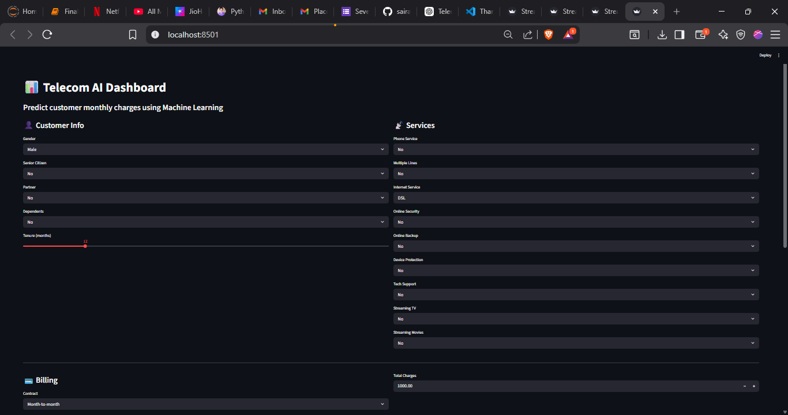
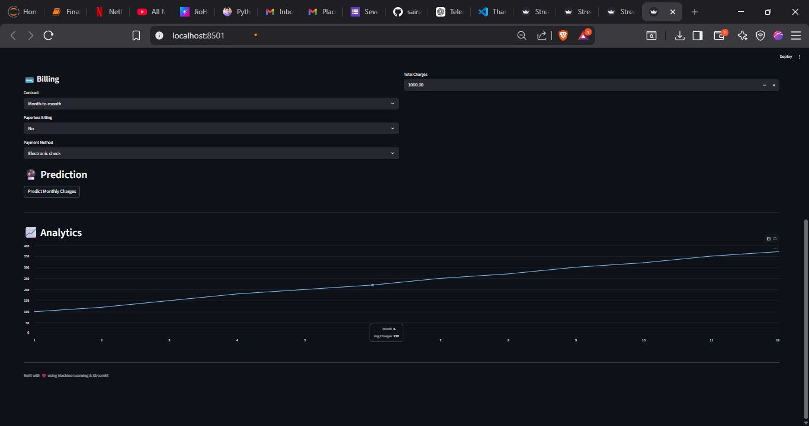

# 📊 Telecom Monthly Charges Prediction

## 🚀 Overview

This project predicts telecom customer **monthly charges** using Machine Learning.

It includes:

* Data preprocessing
* Model training (Linear Regression)
* Model saving/loading
* Streamlit dashboard for real-time prediction

---

## 🧠 Tech Stack

* Python
* Pandas, NumPy
* Scikit-learn
* Streamlit
* Joblib

---

## 📁 Project Structure

telecom-ml-project/
│
├── data/
│   └── Telco-Customer-Churn.csv
│
├── src/
│   ├── data_preprocessing.py
│   ├── train_model.py
│   └── predict.py
│
├── models/
│   └── telecom_model.pkl
│
├── app/
│   └── app.py
│
├── requirements.txt
└── README.md

---

## ⚙️ How to Run

### 1️⃣ Create Virtual Environment

python -m venv venv
venv\Scripts\activate

---

### 2️⃣ Install Dependencies

pip install -r requirements.txt

---

### 3️⃣ Train Model

python src/train_model.py

---

### 4️⃣ Run App

python -m streamlit run app/app.py

---

## 📊 Features

* Predict monthly charges instantly
* User-friendly UI
* Interactive dashboard
* End-to-end ML pipeline

---

## 📸 Output

---

## 🎯 Future Improvements

* Use Random Forest / XGBoost
* Add better encoding (OneHotEncoder)
* Deploy on cloud
* Improve UI/UX

---

## 👨‍💻 Author

Sairaj Bhandalkar
